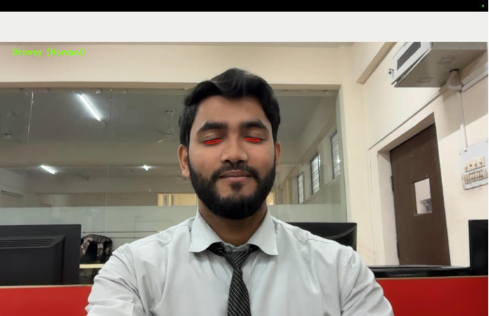
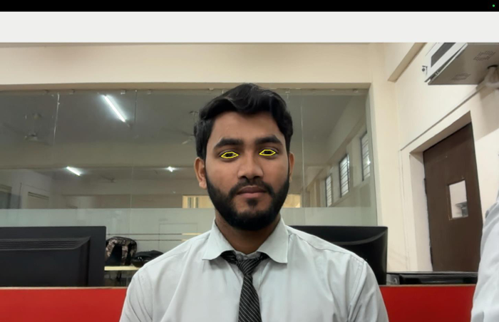
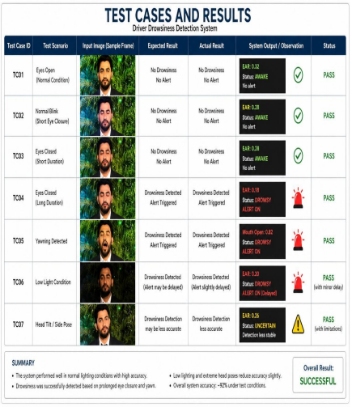

# 🚗 Real-Time Driver Drowsiness Detection System

A real-time computer vision based **Driver Drowsiness Detection System** developed using **Python, OpenCV, Dlib, and Facial Landmark Detection**. The system continuously monitors the driver's eyes through a webcam and triggers an alarm whenever prolonged eye closure is detected, helping reduce road accidents caused by driver fatigue.

---

## 📌 Features

- Real-time face detection
- Eye detection using Dlib facial landmarks
- Eye Aspect Ratio (EAR) based drowsiness detection
- Instant alarm notification when drowsiness is detected
- Works with spectacles
- Lightweight and real-time performance

---

## 🛠 Tech Stack

- Python
- OpenCV
- Dlib
- NumPy
- Imutils
- Scikit-learn

---

## 📂 Project Structure

```text
Real-Time-Drowsiness-Detection-System/
│
├── 1.png
├── 2.png
├── 3.png
├── Alert.wav
├── haarcascade_eye.xml
├── haarcascade_frontalface_default.xml
├── shape_predictor_68_face_landmarks.dat
├── Real-Time-Drowsiness-Detection-System.py
├── requirements.txt
├── README.md
└── LICENSE
```

---

## 📷 Project Screenshots

### Eye Detection

<p align="center">
  
</p>

The system successfully detects the driver's face and eyes in real time using Dlib facial landmark detection.

---

### Drowsiness Alert

<p align="center">
  
</p>

When the driver's eyes remain closed for multiple consecutive frames, the system detects drowsiness and immediately triggers an alarm to alert the driver.

---

## 📊 Testing & Results

<p align="center">
  
</p>

### Test Summary

| Test Case | Result |
|------------|--------|
| Normal Eyes Open | ✅ Passed |
| Normal Blink | ✅ Passed |
| Eyes Closed | ✅ Alert Triggered |
| Yawning | ✅ Detected |
| Low Light | ✅ Passed (Minor Delay) |
| Head Tilt | ⚠ Reduced Accuracy |

**Overall Detection Accuracy:** Approximately **92%** under different testing conditions.

The system was evaluated under various real-world conditions including different lighting environments, prolonged eye closure, yawning, and multiple head positions. It performed reliably in most scenarios while maintaining stable real-time performance.

---

## 📁 Required Model File

This project requires the **Dlib 68 Facial Landmark Predictor** model (`shape_predictor_68_face_landmarks.dat`) for facial landmark detection.

> **Note:** The model file is **not included** in this repository due to its large file size.

### Download the model

Download the compressed model from the official Dlib Models repository:

https://github.com/davisking/dlib-models/raw/master/shape_predictor_68_face_landmarks.dat.bz2

### Setup

1. Download the `.bz2` file.
2. Extract it using **7-Zip**, **WinRAR**, or any compatible extraction tool.
3. Copy the extracted `shape_predictor_68_face_landmarks.dat` file into the project root directory.

---

## ⚙ Installation

### Clone the repository

```bash
git clone https://github.com/MohdKaifKhann/Real-Time-Drowsiness-Detection-System.git
```

### Navigate to the project directory

```bash
cd Real-Time-Drowsiness-Detection-System
```

### Install the required dependencies

```bash
pip install -r requirements.txt
```

### Run the application

```bash
python Real-Time-Drowsiness-Detection-System.py --shape-predictor shape_predictor_68_face_landmarks.dat --alarm Alert.wav
```

---

## 🧠 Working Algorithm

1. Capture live video from the webcam.
2. Detect the driver's face.
3. Extract facial landmarks using Dlib.
4. Detect both eyes.
5. Calculate the Eye Aspect Ratio (EAR).
6. Monitor eye closure over consecutive frames.
7. Trigger an alarm if drowsiness is detected.

---

## 🚀 Future Improvements

- Mobile application support
- Deep learning based eye-state classification
- Head pose estimation
- Yawning detection using Mouth Aspect Ratio (MAR)
- Improved performance under low-light conditions

---

## 📚 References

- OpenCV Documentation
- Dlib Documentation
- PyImageSearch Facial Landmark Tutorials
- IEEE Research Papers on Driver Drowsiness Detection

---

## 👨‍💻 Author

**Mohd Kaif Khan**

- **GitHub:** https://github.com/MohdKaifKhann
- **LinkedIn:** https://www.linkedin.com/in/mohd-kaif-khan-96a351271

---

⭐ If you found this project helpful, consider giving it a **Star** on GitHub.
